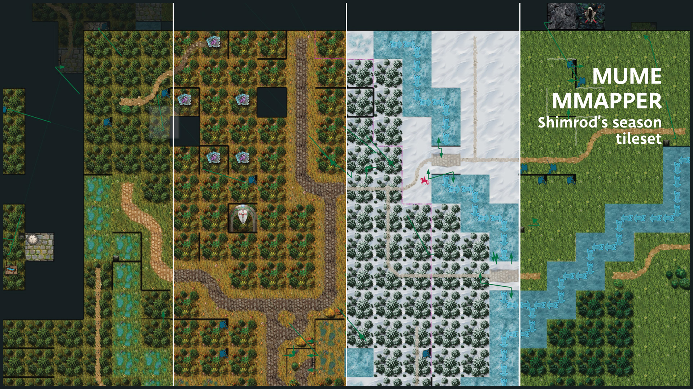

# NSF-s-Mmapper-Seasons-Tileset

A tileset for Mmapper for each season of the year.

Right now it's not automated and each season needs to be switched manually (overwrite pixmaps folder with desired season).

I personally am building my own map in more vertical way than the default Arda map within mMapper. So I use a lot of icons a bit differently (for example there are not many Elite mob icons in default map, even though lots of mobs past the Bree could be called Elite), but this is probably to each own taste.

I made the tileset to be used as visually consistent package, but you may use the tiles with other mods as you see fit, even edit them within your own tiles, just give credit when you do so please (if you redistribute the set).

Please don't use tiles with Ai learning software (some creators of the assets I used, were strictly against), but since I have online trust issues I Glazed them, just in case... 🙂

current version is 0.92 (will be updating here, when I'll have the time in the future)

https://youtu.be/-u46sEhjAWE?si=ee1LMbPz-e_hwEKa
